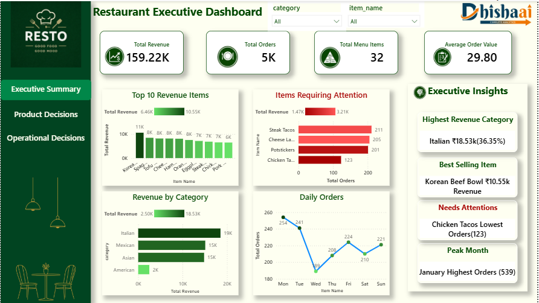
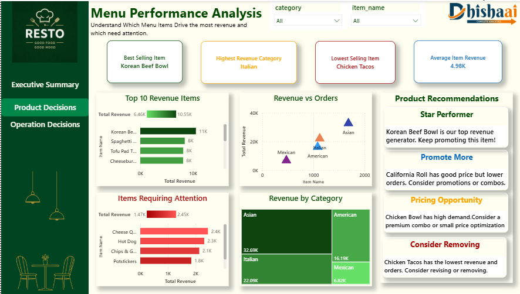
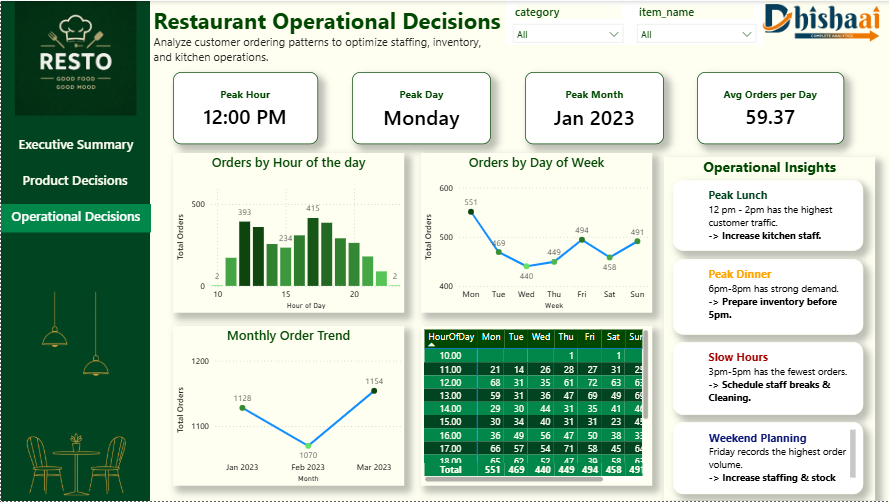

<div align="center">

# 🍽️ Restaurant Sales Analysis Dashboard

### End-to-End Data Analytics Project using MySQL • Python • Power BI


</div>

---

# 📌 Project Overview

This project analyzes restaurant sales data to help restaurant owners make data-driven decisions through interactive Power BI dashboards.

The project follows an end-to-end analytics workflow using MySQL, Python, and Power BI.

---

# 🎯 Business Objectives

✔ Analyze restaurant revenue

✔ Identify top & low-performing menu items

✔ Understand customer ordering behavior

✔ Improve operational efficiency

✔ Generate actionable business recommendations

---

# 🛠️ Tech Stack

| Tool | Purpose |
|-------|----------|
| 🗄️ MySQL | Data Querying |
| 🐍 Python | Data Cleaning & EDA |
| 📊 Power BI | Dashboard Development |
| 📈 DAX | Business Measures |

---

# 🔄 Workflow

```text
📂 Dataset
      │
      ▼
🗄️ MySQL
Business Queries
      │
      ▼
🐍 Python
EDA & Cleaning
      │
      ▼
📊 Power BI
Dashboard & DAX
      │
      ▼
💡 Business Insights
      │
      ▼
📈 Recommendations
```

---

# 📊 Dashboard Pages

## Executive Summary



---

## Product Decisions



---

## Operational Decisions



---

# 📈 Dashboard Features

✅ Interactive KPIs

✅ Dynamic Slicers

✅ Executive Dashboard

✅ Product Performance

✅ Operational Insights

✅ Business Recommendations

---

# 📂 Repository Structure

```text
Restaurant_Sales_Analysis
│
├── Dataset
├── Images
├── MySQL
├── Power_BI
├── Python
├── Documentation
└── README.md
```

---

## 📊 Key Insights

🏆 Italian cuisine emerged as the top-performing category, generating ₹18.53K in revenue (36.35% of total sales).

🥩 Korean Beef Bowl was the highest revenue-generating menu item, contributing ₹10.55K in sales.

⚠️ Chicken Tacos recorded the fewest orders (123), indicating an opportunity to review pricing, promotion, or customer preferences.

📅 January achieved the highest order volume with 539 orders, reflecting the strongest monthly demand.

💰 The restaurant processed 5,000 customer orders, with an Average Order Value (AOV) of ₹29.80, providing a benchmark for future revenue growth strategies.

---

# 🚀 Future Enhancements

- Sales Forecasting
- Customer Segmentation
- Profit Analysis
- Inventory Dashboard
- Multi-store Analysis

---

# 👩‍💻 About Me

**Tanu**

Aspiring Data Analyst passionate about SQL, Python, Power BI, and Business Intelligence.

---

## ⭐ If you found this project helpful, please consider giving it a Star!
